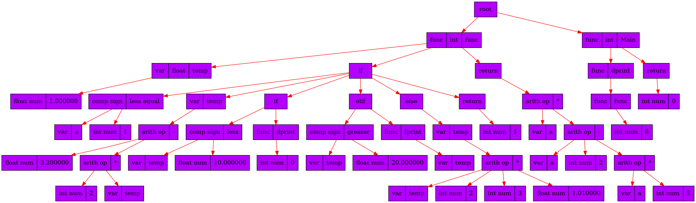

# Overview
This is a compiler of C-like programming language. You can find grammar of this language in file grammar.txt. Features currently supported are two variable types (float, int), global variables and standard input output library to scan and print numbers (dprint, fprint, dscan, fscan). Here's an example program
```c++
int func(int a) [
  float temp = 1.0
  if (a <= 1) [
    temp = 3.2 - 2 * temp

    if (temp < 10.0) [
      dprint(0)
    ] else if (temp > 20.0) [
      fprint(temp)
    ] else [
      temp = temp * 2 * 3 * 1.01
    ]

    return 1
  ]

  return a * (a - 2 - a * 5)
]

int Main() [
  dprint(func(6))
  return 0
]
```
Tree of this program

# Compiling and running
```
make init
make
./out
```